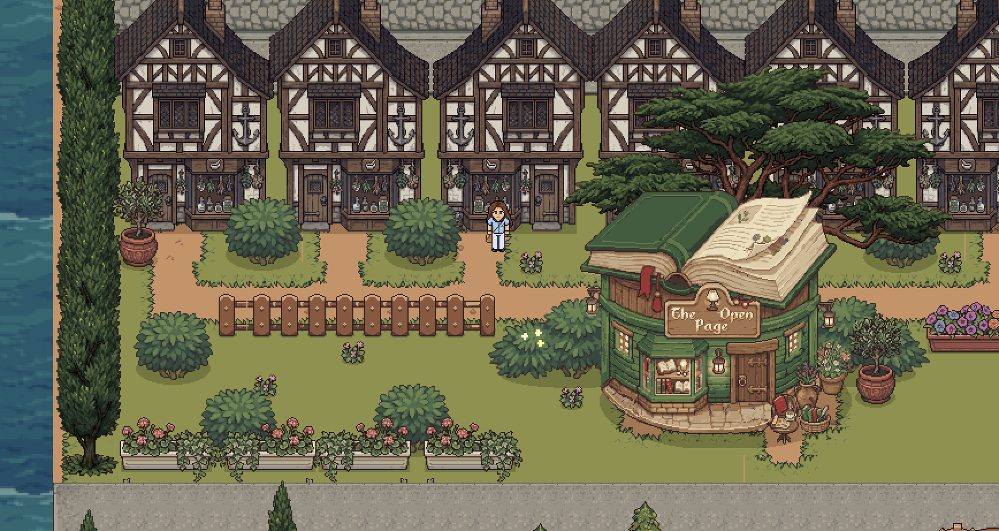
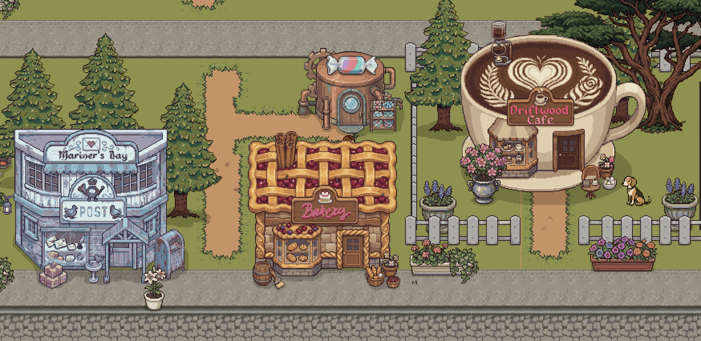
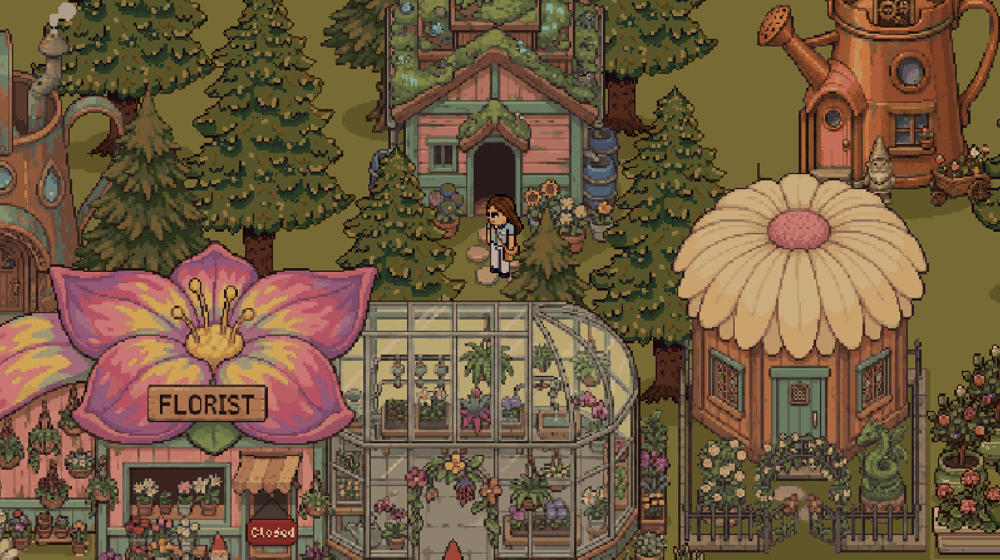
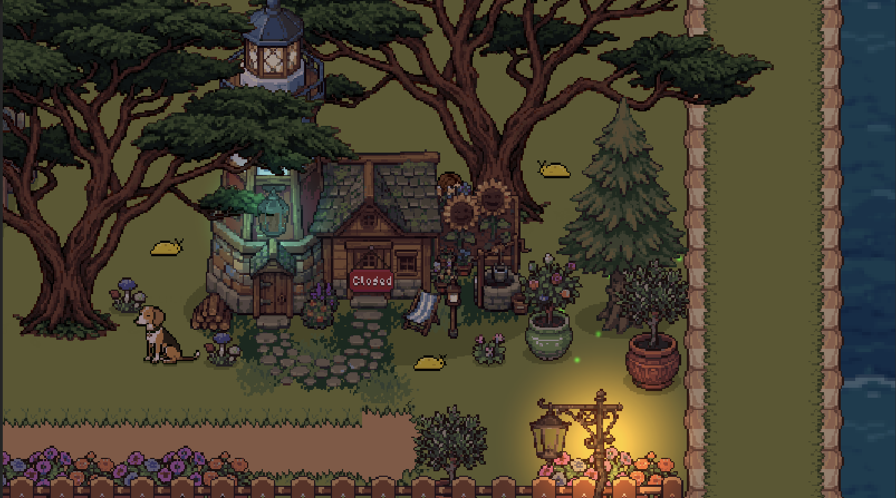
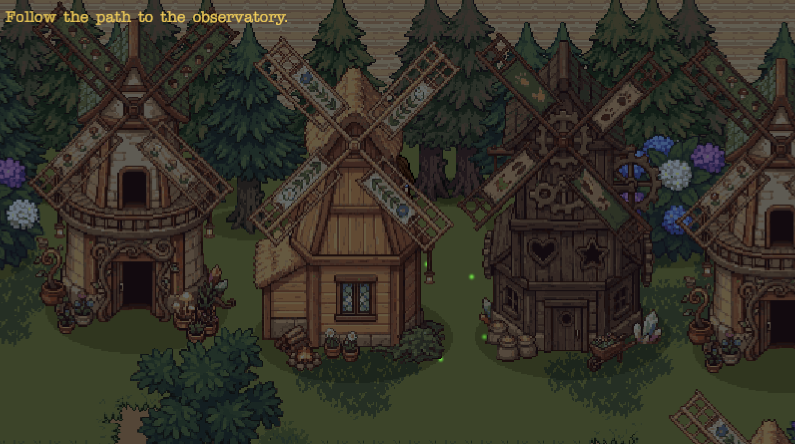

# Return to Sender

Return to Sender is a short atmospheric narrative game set in a strange coastal neighborhood.

You play as a courier assigned to deliver a strange package. What begins as an ordinary delivery gradually becomes something much more unsettling as you explore the neighborhood, speak with residents, and uncover information connected to the delivery.

The game focuses on exploration, dialogue, environmental storytelling, and a slow-building sense of unease.

## Features

* Explore an atmospheric coastal neighborhood
* Play as a courier carrying out a mysterious delivery
* Discover locations throughout the city
* Interact with residents and uncover their stories
* Progress through conversations and story checkpoints
* Record important information in the journal
* Explore pixel-art environments with atmospheric lighting
* Experience a mysterious ending

## Gameplay

The game begins with a delivery assignment in a coastal neighborhood. Explore the surrounding streets, buildings, and outdoor areas while speaking with the people who live there.

As you investigate the neighborhood, conversations reveal information about the delivery and the strange events connected to it. Completing certain conversations advances the story and may cause changes in the environment.

Pay attention to dialogue and environmental details. Some locations or events may only become available after specific conversations.

The game is primarily focused on exploration and discovery rather than combat.

## Controls

| Action                           | Keyboard           |
| -------------------------------- | ------------------ |
| Move                             | WASD or arrow keys |
| Interact                         | E                  |
| Advance dialogue                 | Space or E         |
| Finish the current dialogue line | Space or E         |
| Open or close the menu           | Esc                |
| Open or close the journal        | Tab                |
| Navigate menus                   | Mouse              |

## Story Progression

The game uses a checkpoint-based story system. Conversations are recorded when they are completed, and certain characters can advance the current story checkpoint.

Some environmental changes occur after specific conversations. If an area appears to be blocked or unavailable, continue exploring and speaking with residents to determine what needs to happen next.

The journal records important information discovered during conversations.

## Scenes

The project is organized into several scenes:

* `Intro`
  Displays the animated title screen and Play button.

* `PostOffice`
  The first playable scene. It contains the persistent game systems and the initial coastal neighborhood environment.

* `Main`
  Contains the main outdoor exploration area and additional locations throughout the neighborhood.

* `Ending`
  Displays the final ending screen, including the ending message and Exit button.
  


## Technical Details

Return to Sender was developed in Unity using the Universal Render Pipeline.

The project includes:

* 2D pixel-art environments
* Coastal city and neighborhood environments
* 2D lighting
* Animated sprites
* Dialogue-driven progression
* Persistent managers
* Scene-based transitions
* Audio effects and ambient atmosphere
* UI fade effects
* A checkpoint-based narrative system
* Journal-based information tracking



## Development Notes

The game is designed around a simple narrative structure:

```text
Intro
→ PostOffice
→ Main
→ EndingSequence
→ Ending
```

The intro and ending scenes are separate from the playable scenes so their UI can be managed independently. The persistent game systems remain in `PostOffice`, which is the first playable scene.

## Credits

Sound effects: pixabay.com
Character base template: https://sayaka04.itch.io/sprite-template-32x48
Rest of the pixel art assets and main music made by me.

Developed with Unity.

## License

This project is intended for educational and personal use unless otherwise stated.
